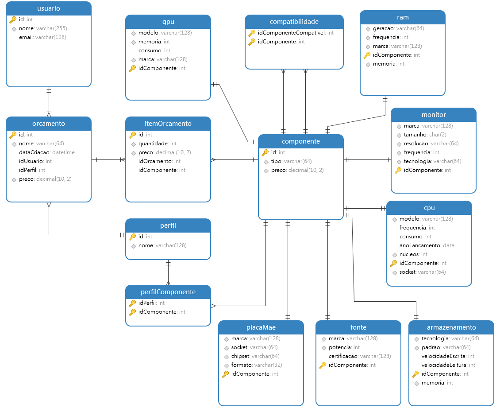
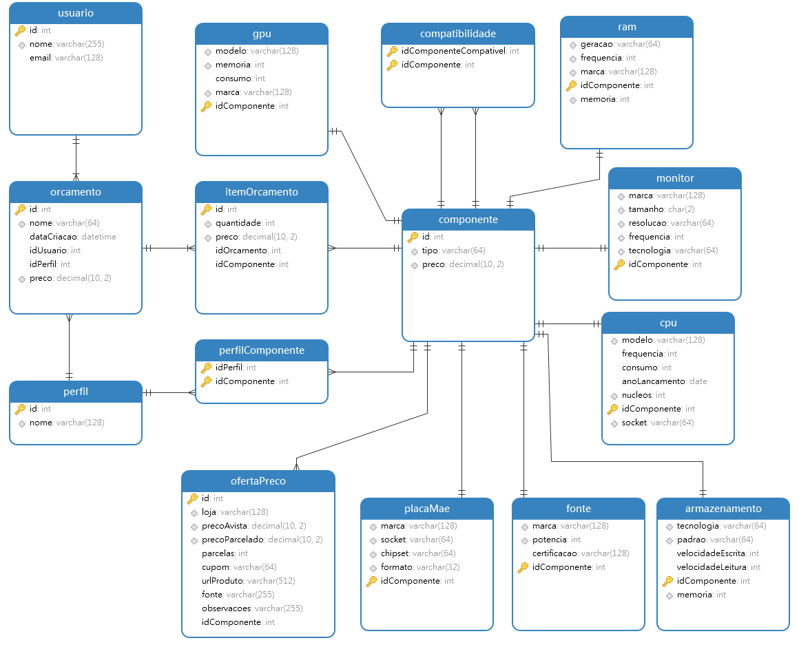

# Best Hardware API

API REST em Spring Boot para gerenciar componentes de hardware, perfis de uso, orcamentos e recomendacoes de computadores.

O projeto permite cadastrar pecas, consultar filtros por especificacoes, registrar ofertas de preco, montar orcamentos por IDs de componentes, validar compatibilidade e gerar recomendacoes de PC por perfil de uso.

## Funcionalidades

- Cadastro e consulta de CPU, GPU, RAM, fonte, armazenamento, monitor e placa-mae.
- Perfis de uso: `trabalho`, `jogo-inicial`, `jogo-intermediario`, `jogos-pesados` e `profissional`.
- Orcamentos com calculo automatico do total.
- Ofertas de preco por componente.
- Uso da menor oferta a vista em orcamentos e recomendacoes, com fallback para o preco base do componente.
- Validacao de compatibilidade entre pecas.
- Swagger/OpenAPI para testar a API pelo navegador.

## Tecnologias

- Java 21
- Spring Boot 4.0.6
- Spring Web
- Spring Data JPA
- Bean Validation
- Swagger/OpenAPI com springdoc
- H2 Database em memoria
- Lombok
- Maven Wrapper

## Como executar

No Windows:

```powershell
.\mvnw.cmd spring-boot:run
```

Rodar testes:

```powershell
.\mvnw.cmd test
```

A aplicacao sobe por padrao em:

```text
http://localhost:8080
```

Swagger:

```text
http://localhost:8080/swagger-ui.html
```

OpenAPI JSON:

```text
http://localhost:8080/v3/api-docs
```

H2 Console:

```text
http://localhost:8080/h2-console
JDBC URL: jdbc:h2:mem:hardware_db
User: sa
Password: vazio
```

## Endpoints principais

```text
/api/usuarios
/api/perfis
/api/componentes
/api/cpus
/api/gpus
/api/rams
/api/fontes
/api/armazenamentos
/api/monitores
/api/placas-mae
/api/orcamentos
/api/itens-orcamento
/api/ofertas-preco
/api/recomendacoes
```

Exemplos rapidos:

```text
GET  /api/cpus?socket=AM4&nucleosMinimos=6
GET  /api/ofertas-preco?componenteId=1
GET  /api/ofertas-preco/componentes/1/menor-preco
GET  /api/recomendacoes/perfis/jogo-inicial
POST /api/recomendacoes/compatibilidade
POST /api/orcamentos
```

## Demonstracao rapida

1. Suba a aplicacao com `.\mvnw.cmd spring-boot:run`.
2. Abra `http://localhost:8080/swagger-ui.html`.
3. Consulte componentes em `GET /api/cpus?socket=AM4&nucleosMinimos=6`.
4. Veja a menor oferta em `GET /api/ofertas-preco/componentes/1/menor-preco`.
5. Gere uma recomendacao em `GET /api/recomendacoes/perfis/jogo-inicial`.
6. Crie um orcamento em `POST /api/orcamentos`.

Exemplo de orcamento:

```json
{
  "nome": "PC demonstracao",
  "usuarioId": 1,
  "perfilId": 1,
  "itens": [
    {
      "componenteId": 1,
      "quantidade": 1
    },
    {
      "componenteId": 3,
      "quantidade": 1
    }
  ]
}
```

## Diagramas

DER base:



DER com ofertas de preco:



## Documentacao

- [API](docs/API.md): endpoints, filtros, exemplos e tratamento de erros.
- [Arquitetura](docs/ARQUITETURA.md): camadas, entidades, DTOs, Specifications e regra de preco preferencial.
- [Guia de mudancas 2026-05 semana 5](docs/GUIA_MUDANCAS_2026-05-SEMANA-5.md)
- [Guia de mudancas 2026-06 semana 1](docs/GUIA_MUDANCAS_2026-06-SEMANA-1.md)

## Estado atual

Implementado:

- models JPA, repositories, services e controllers REST;
- DTOs e validacoes;
- filtros dinamicos com `Specification`;
- Swagger/OpenAPI;
- ofertas de preco por componente;
- recomendacoes por perfil;
- validacao de compatibilidade;
- tratamento centralizado de erros;
- testes de integracao basicos;
- dados iniciais para testes com H2.
