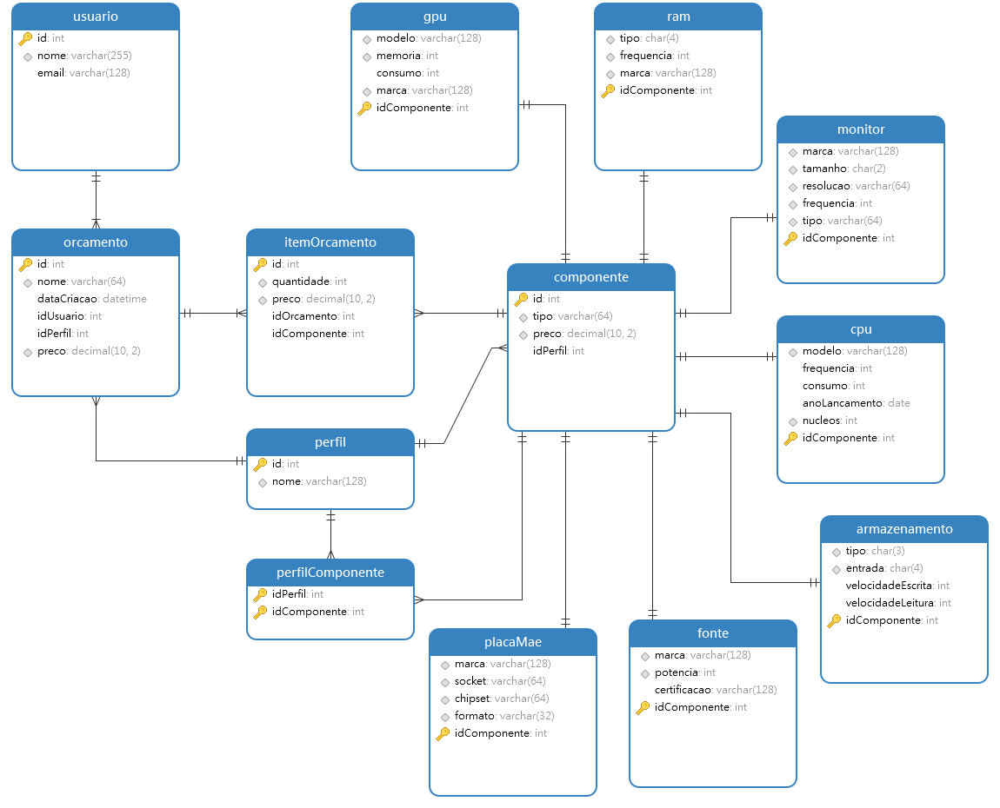

# Best Hardware API

## 1. Domínio do Problema
O sistema gerencia o catálogo e a orçamentação de peças de hardware (CPUs, GPUs, Placas-mãe, etc). Os utilizadores podem criar orçamentos personalizados contendo múltiplos componentes, e os componentes podem pertencer a perfis específicos de uso (ex: Gamer, Profissional) e ser providenciados por múltiplos fornecedores.

## 2. Diagrama ER 

